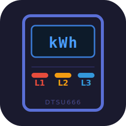

# foxess_dtsu666



Home Assistant custom component for the Chint DTSU666 three-phase energy meter, as wired by FoxESS inverters on their RS485 bus.

[](https://github.com/hacs/integration)
[](https://my.home-assistant.io/redirect/hacs_repository/?owner=martb&repository=foxess_dtsu666&category=integration)

> **Early stage / use at your own risk.**
> This project started as a debugging tool after FoxESS firmware 1.93 introduced intermittent *Meter Lost* faults. The goal was to tap the RS485 bus and see exactly what was happening between the inverter and the meter. It has since grown into a full Home Assistant integration, but it is still young and has only been tested on a handful of setups.
>
> The code was written with the help of [Claude](https://claude.ai) (Anthropic). Review it before running it in production.

## How it works

The DTSU666 sits on an RS485 bus where the inverter polls it periodically. This integration taps the same bus passively and decodes the responses as they go by — no extra polling, no bus contention. If the inverter goes offline and traffic stops, the sniffer detects the silence (default: 15 s) and switches to active polling mode, querying the meter directly until things resume.

## Connecting to the meter bus (FoxESS H3)

The DTSU666 connects to the H3 via a two-wire RS485 cable. RS485 is a differential multi-drop bus (signal lines are labelled **485A** / **D+** and **485B** / **D−**), so you can add a third device in parallel without disturbing the existing inverter↔meter traffic. The integration runs in passive/listen-only mode by default, so it never drives the bus at the same time as the inverter.

**Preferred — at the inverter communication terminal block**

The H3 exposes the meter RS485 pair on its low-voltage communication terminal block as **Meter 485A** and **Meter 485B**. This is the safest place to connect because you stay well away from the mains-voltage terminals inside the meter enclosure. Bridge from those two terminals to your RS485 adapter.

```
H3 communication terminal block
  Meter 485A ──┬── (existing wire to DTSU666 terminal 15)
               └── RS485 adapter A (D+)
  Meter 485B ──┬── (existing wire to DTSU666 terminal 16)
               └── RS485 adapter B (D−)
```

**Alternative — at the DTSU666 meter terminals**

The DTSU666 has its RS485 pair on **terminal 15 (485A)** and **terminal 16 (485B)**. Connecting here works electrically, but the meter enclosure also contains mains-voltage terminals. Only do this if you are comfortable working near live mains wiring and your local regulations permit it.

**Adapter**

Any RS485-to-USB or RS485-to-TCP/Ethernet adapter will work. If your HA machine is not co-located with the inverter, an RS485-over-network adapter avoids running a long USB cable. The default bus speed is **9600 baud, 8N1** — leave that unchanged unless you have explicitly changed it on the inverter.

## Installation

### HACS (recommended)

1. In Home Assistant, go to **HACS → Integrations → ⋮ → Custom repositories**.
2. Add `https://github.com/martb/foxess_dtsu666` as an **Integration**.
3. Search for **FoxESS DTSU666 Sniffer**, install it, then restart Home Assistant.

Or click the button at the top of this page to open the repository directly in HACS.

### Manual

Copy the `custom_components/foxess_dtsu666/` folder into your HA configuration directory (next to `configuration.yaml`) and restart.

## Setup

**Settings → Integrations → Add integration → FoxESS DTSU666 Sniffer**

The wizard asks for the connection type and serial/TCP parameters, briefly scans the bus to find active slave IDs, then asks about active polling.

**Slave ID** — which device to poll when the inverter goes silent. You can skip this and set it later via *Reconfigure*.

**Always poll** — drives the bus directly from the start, bypassing passive mode. Only enable this if nothing else is polling the meter; two bus masters running simultaneously will produce CRC errors.

## Sensors

| Sensor | Register group | Enabled by default |
|---|---|---|
| Voltage L1 / L2 / L3 | 0x1510 | yes |
| Current L1 / L2 / L3 | 0x1510 | yes |
| Active power total | 0x1510 | yes |
| Active power L1 / L2 / L3 | 0x151E | yes |
| Reactive power total / L1 / L2 / L3 | 0x151E | no |
| Apparent power total / L1 / L2 / L3 | 0x1510 | yes |
| Power factor total / L1 / L2 / L3 | 0x1510 | no |
| Frequency | 0x1510 | yes |
| Energy import total | 0x181E | yes |
| Energy export total | 0x181E | yes |
| Energy import / export L1 / L2 / L3 | 0x181E | no |
| Reactive energy Q1 / total | 0x181E | no |
| cos φ (computed from P and Q) | derived | yes |

Diagnostic sensors (on the bus device, always available): CRC errors, timeouts, resyncs, consecutive errors, average response time, per-address poll intervals, last bus error, last seen age, and a list of any register addresses seen on the bus that this integration does not handle.

A measurement sensor becomes *Unavailable* if its register group has not been seen within the staleness threshold (default 60 s, configurable).

## Firmware notes

FoxESS inverter firmware 1.91 only polls register address 0x1510. Addresses 0x151E and 0x181E are never requested, which means per-phase active power, all energy totals, and reactive power will be unavailable. The diagnostic sensors *Poll interval 0x151E* and *Poll interval 0x181E* will show *Unknown* when this is the case.

Workaround: set the slave ID in the integration options. When the inverter eventually goes quiet (or if you enable *Always poll*), the sniffer will fill in the missing register groups itself.

## Future work

**Per-address supplemental polling** — if specific register groups have not been seen for a while but the bus is otherwise active, poll only those addresses rather than taking over the whole bus. This would handle the firmware 1.91 case automatically without any manual configuration. The groundwork (per-address poll-interval sensors, unknown-endpoint tracking) is already in place.

## License

MIT — see [LICENSE](LICENSE).
